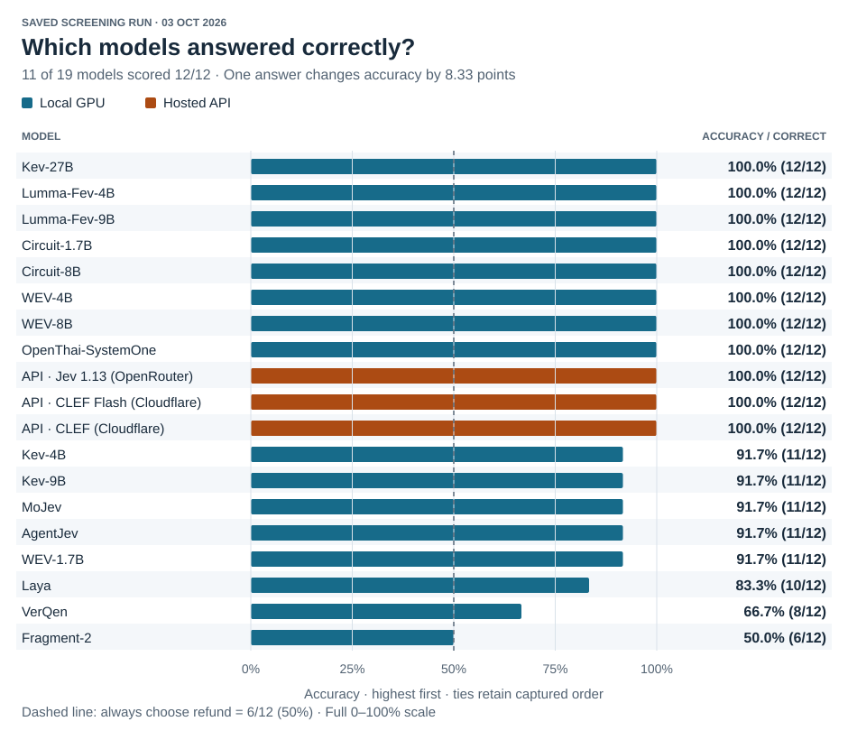
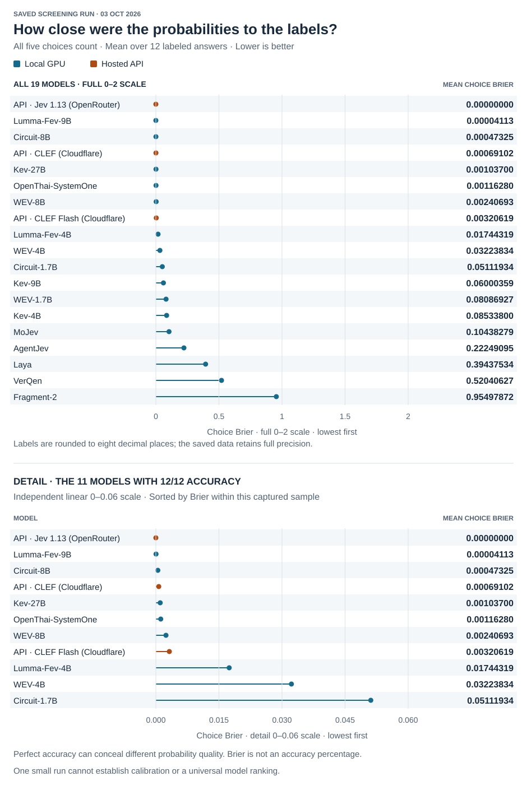
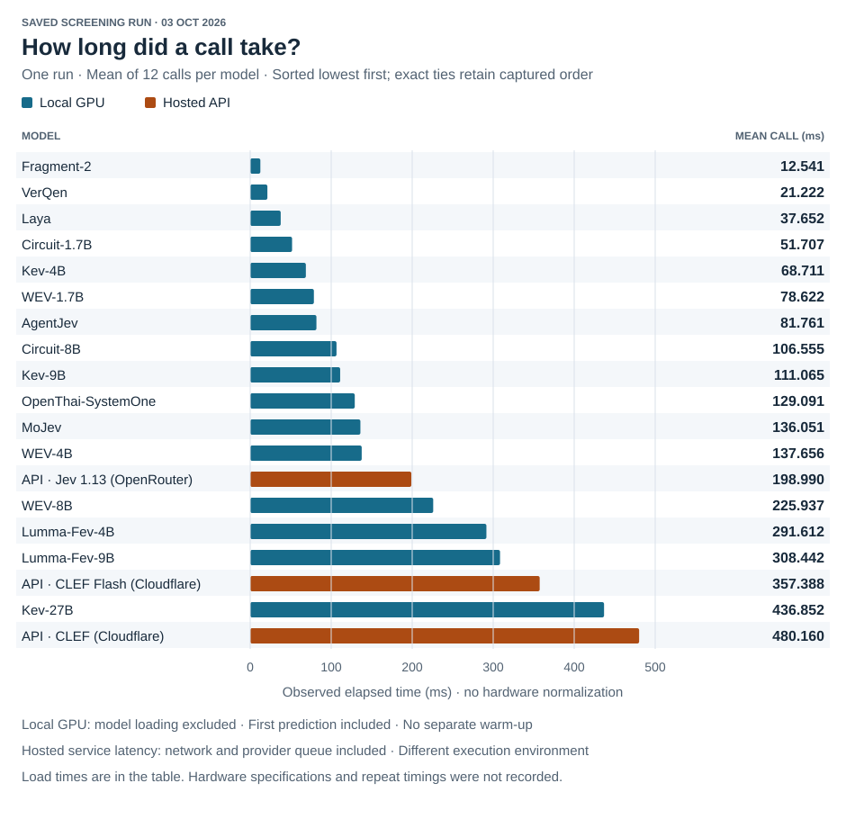

# Simple Decision Model Evaluation

I wanted a simple way to evaluate which recently released decision models were worth spending more extensive time
evaluating. This experiment uses
short customer support messages to check whether a model can identify what someone is asking for. If a model struggles
here, then I consider it useless for more advanced use cases. Correct answers are only part of that decision.
I also want to know whether the probabilities behind those answers make sense, and how long each model takes to answer.

The Python/Streamlit app sends the same contexts and editable binary or multiple choice questions to each selected model.
You can replace the example messages, change the question and choice meanings, and supply your own expected labels.
Expected labels and case IDs are kept out of the model inputs.

## October 3rd 2026 Evaluation Run

This run used **12 messages, one multiple-choice question, and 19 models**.
The question was: “What is the customer’s current primary request?” The choices were `refund`, `replacement`, `repair`,
`order_status`, and `other`. The messages included explicit and indirect refund requests, rejected refunds, pre-purchase
questions, and a past refund followed by a question about a new order. There were six refund cases, two order-status
cases, two other cases, one replacement case, and one repair case. **Always choosing refund would score 6/12 (50%).**
The [full run details](results/2026-10-03/README.md) contain the exact question, choice definitions, messages, and labels.

### Accuracy

Accuracy counts how often the selected answer matched the expected label.



### Brier scores and the probabilities behind the answers

Accuracy treats a correct answer the same whether the model gave it a 46% probability or a 99% probability.
**Choice Brier scores also measure the probabilities assigned to all five choices.** They reward probability placed on
the expected answer and penalize probability placed on the other answers. A confident mistake receives a larger penalty
than a more uncertain mistake. Lower is better.

```text
// N = 12 for every model in this run

Choice Brier = (1 / N) × Σ answers Σ five choices (probability − target)²
```




### Observed timings

Time to call the models. Time to load the model into the GPU is excluded.



### Numeric overview and model reports

Each model link opens its full answers, probability distributions, per-answer scores, timings, configuration, and runtime
details. Accuracy and Choice Brier each use 12 answered, labeled cases for every model.

| Model                                                                  | Execution | Correct | Accuracy | Choice Brier ↓ | Mean call (ms) |     Load (s) |
| ---------------------------------------------------------------------- | --------- | ------: | -------: | -------------: | -------------: | -----------: |
| [Laya](results/2026-10-03/laya.md)                                     | Local     |   10/12 |    83.3% |     0.39437534 |         37.652 |        2.108 |
| [Kev-4B](results/2026-10-03/kev-4b.md)                                 | Local     |   11/12 |    91.7% |     0.08533800 |         68.711 |        6.075 |
| [Kev-9B](results/2026-10-03/kev-9b.md)                                 | Local     |   11/12 |    91.7% |     0.06000359 |        111.065 |        6.576 |
| [Kev-27B](results/2026-10-03/kev-27b.md)                               | Local     |   12/12 |   100.0% |     0.00103700 |        436.852 |       28.292 |
| [Lumma-Fev-4B](results/2026-10-03/lumma-fev-4b.md)                     | Local     |   12/12 |   100.0% |     0.01744319 |        291.612 |        4.715 |
| [Lumma-Fev-9B](results/2026-10-03/lumma-fev-9b.md)                     | Local     |   12/12 |   100.0% |     0.00004113 |        308.442 |        5.346 |
| [MoJev](results/2026-10-03/mojev.md)                                   | Local     |   11/12 |    91.7% |     0.10438279 |        136.051 |        2.796 |
| [AgentJev](results/2026-10-03/agentjev.md)                             | Local     |   11/12 |    91.7% |     0.22249095 |         81.761 |        3.361 |
| [VerQen](results/2026-10-03/verqen.md)                                 | Local     |    8/12 |    66.7% |     0.52040627 |         21.222 |        1.393 |
| [Fragment-2](results/2026-10-03/fragment-2.md)                         | Local     |    6/12 |    50.0% |     0.95497872 |         12.541 |        0.572 |
| [Circuit-1.7B](results/2026-10-03/circuit-1-7b.md)                     | Local     |   12/12 |   100.0% |     0.05111934 |         51.707 |        3.343 |
| [Circuit-8B](results/2026-10-03/circuit-8b.md)                         | Local     |   12/12 |   100.0% |     0.00047325 |        106.555 |        5.627 |
| [WEV-1.7B](results/2026-10-03/wev-1-7b.md)                             | Local     |   11/12 |    91.7% |     0.08086927 |         78.622 |        2.925 |
| [WEV-4B](results/2026-10-03/wev-4b.md)                                 | Local     |   12/12 |   100.0% |     0.03223834 |        137.656 |        4.308 |
| [WEV-8B](results/2026-10-03/wev-8b.md)                                 | Local     |   12/12 |   100.0% |     0.00240693 |        225.937 |        7.875 |
| [OpenThai-SystemOne](results/2026-10-03/openthai-systemone.md)         | Local     |   12/12 |   100.0% |     0.00116280 |        129.091 |        2.241 |
| [Jev 1.13 (OpenRouter)](results/2026-10-03/jev-1-13-openrouter.md)     | Hosted    |   12/12 |   100.0% |     0.00000000 |        198.990 | Not reported |
| [CLEF Flash (Cloudflare)](results/2026-10-03/clef-flash-cloudflare.md) | Hosted    |   12/12 |   100.0% |     0.00320619 |        357.388 | Not reported |
| [CLEF (Cloudflare)](results/2026-10-03/clef-cloudflare.md)             | Hosted    |   12/12 |   100.0% |     0.00069102 |        480.160 | Not reported |

## Run your own screen

For a new checkout, install Git, `just`, and Python 3.13, then run from the project folder:

```sh
just setup
just download-models
just serve
```

Setup creates the isolated environments and installs pinned dependencies and model sources. Downloads are cached;
you can select local model keys, for example `just download-models laya kev lumma9b`. MoJev requires approved Hugging Face
access and `HF_TOKEN` or a local login. Hosted Jev requires `OR_TOKEN`; CLEF requires `CLOUDFLARE_AUTH_TOKEN` and
`CLOUDFLARE_ACCOUNT_ID`. Hosted models stay disabled until their configuration is present, and both CLEF models are
optional and unselected by default. The supported launcher reports missing configuration before starting the app.

In the browser, choose models, edit the context and question tables, provide expected labels, and run the comparison.
Export JSON to preserve the full results. `just` lists the available commands; `just serve --server.port 8502` changes
the port. The CLI also accepts question and context files; see the [examples](examples/) and
`.venv/bin/python compare.py --help`.
